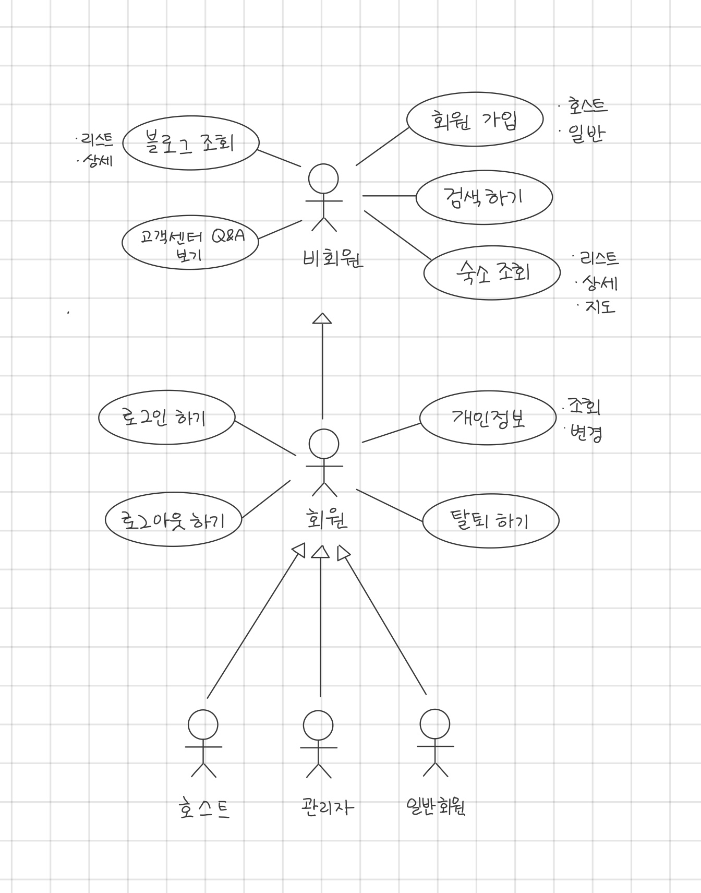
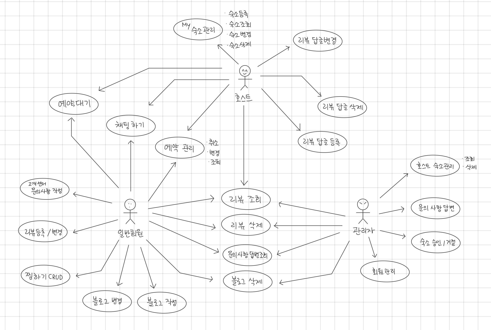

리뷰 CRUD + 리뷰 답글 CRUD + 검색하기&숙소리스트&상세&지도보기

# 유스케이스 목록

## Actors

### 비회원
- 시스템에 로그인 하지 않은 사용자

### 회원
- 시스템에 로그인 한 사용자

### 관리자
- 관리자에 등록된 로그인 사용자

### 호스트
- 호스트로 등록된 로그인 사용자

### 일반회원
- 일반회원으로 등록된 로그인 사용자

## Use-Cases

### [회원가입](./lyu/회원가입.md)(비회원)
- 비회원이 로그인을 위해 회원에 가입하는 것.

### [회원탈퇴](./lyu/개인정보관리.md)(회원)
- 회원이 서비스에서 탈퇴하는 것.

### [로그인 하기](./lyu/로그인.md)(회원)
- 회원이 로그인을 하는 것

### [로그아웃 하기](./lyu/로그아웃.md)(회원)
- 회원이 로그아웃을 하는 것

### [숙소 검색하기](./byungjun/uc001-search.md)(회원, 비회원)
- 회원, 비회원이 숙소를 검색하는 것

### [지도 보기](./byungjun/uc002-viewMap.md)(회원, 비회원)
- 회원, 비회원이 리스트에서 지도 크게보기를 클릭하여 지도를 보는 것

### [블로그 리스트 보기](./minhee/06-bloglist.md)(회원, 비회원)
- 회원, 비회원이 블로그 리스트를 보는 것.

### [블로그 상세 보기](./minhee/07-blogdetail.md)(회원, 비회원)
- 회원, 비회원이 블로그 리스트에서 글을 선택하여 상세하게 보는 것

### [개인정보 관리](./lyu/개인정보관리.md)(일반회원, 호스트)
- 일반회원, 호스트가 자신의 정보를 조회, 변경하는 것

### [고객센터 QnA 보기](./minhee/01-Q&Aview.md)(비회원, 회원)
- 회원, 비회원이 고객센터 QnA를 조회하는 것

### 개인정보 조회하기(회원)
- 회원이 개인정보를 조회하는 것

### 개인정보 변경하기(회원)
- 회원이 개인정보를 변경하는 것

### [숙소관리](./sijin/uc-MyHostcrud.md)(호스트)
- 호스트가 자신의 숙소를 등록, 조회, 변경, 삭제 하기

### [리뷰 조회](./byungjun/uc004-reviewManagement.md)(회원)
- 호스트가 등록한 숙소의 리뷰를 조회 하는 것

### 리뷰 삭제하기(일반회원, 관리자)
- 일반회원이 작성한 리뷰를 일반회원과 관리자가 삭제하는 것

### 리뷰 답글 등록하기(호스트)
- 호스트가 등록한 숙소의 리뷰의 대한 답글을 다는 것.

### 리뷰 답글 삭제하기(호스트)
- 호스트가 작성한 답글을 삭제 하는 것.

### 리뷰 답글 변경하기(호스트)
- 호스트가 작성한 답글을 변경 하는 것.

### [호스트 숙소 관리](./sijin/uc-Reservation list Hostcrud.md)(관리자)
- 호스트가 등록한 숙소를 조회, 삭제 하는 것.

### [숙소 예약하기](./jinwook/숙소 예약 하기.md)(일반회원)
- 일반회원이 숙소를 예약하는 것.

### [숙소 예약취소하기](./jinwook/숙소 예약 취소.md)(일반회원, 호스트)
- 일반회원, 호스트가 예약한 숙소를 취소하는 것.

### [숙소 예약 변경하기](./jinwook/숙소 예약 변경.md)(일반회원, 호스트)
- 일반회원, 호스트가 예약되어 있는 숙소에 대해 변경하는 것

### [숙소 예약 조회하기](./jinwook/숙소 예약 조회.md)(일반회원, 호스트)
- 일반회원, 호스트가 예약한 숙소를 조회하는 것

### [숙소 예약 대기하기](./jinwook/숙소 예약 대기.md)(일반회원, 호스트)
- 일반회원이 예약하고 싶은 날짜에 예약이 되어 있으면 대기하는 것

### [채팅하기](./minhee/05-chathost.md)(일반회원, 호스트)
- 일반회원과 호스트가 1:1로 채팅하는 것

### [고객센터 문의사항 작성하기](./minhee/02-question.md)(일반회원)
- 일반회원이 고객센터 문의사항을 작상하는 것.

### [고객센터 문의사항 조회하기](./minhee/04-questionansView.md)(일반회원, 관리자)
- 일반회원이 작성한 문의사항을 조회하는 것

### [고객센터 문의사항 답변하기](./minhee/03-questionans.md)(관리자)
- 일반회원이 작성한 문의사항을 관리자가 답변하는 것.

### [리뷰 등록, 변경하기](./byungjun/uc004-reviewManagement.md)(일반회원)
- 일반회원이 다녀온 숙소에 대해 리뷰를 등록하고 변경하는 것.

### [블로그 작성 변경하기](./minhee/08-blogcreateupdate.md)(일반회원)
- 일반회원이 블로그를 작성하고 변경하는 것

### [블로그 삭제하기](./minhee/09-blogdelete.md)(일반회원, 관리자)
- 일반회원이 작성한 블로그를 삭제하는 것.

### [찜하기 관리](./lyu/찜관리.md)(일반회원)
- 일반회원이 숙소를 찜하고 메모하는 것.

### 회원 관리(관리자)
- 관리자가 회원을 조회, 삭제 하는 것.

### [숙소 승인/거절](./sijin/uc-ManagerCrud.md)(관리자)
- 호스트가 등록한 숙소를 승인하거나 거절하는 것
